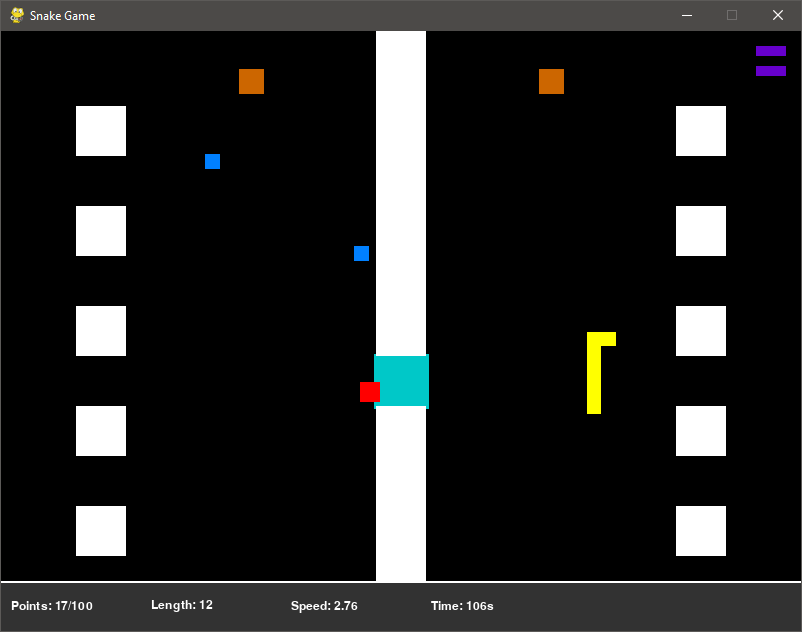
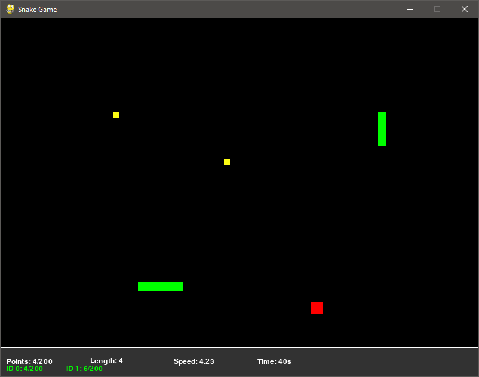
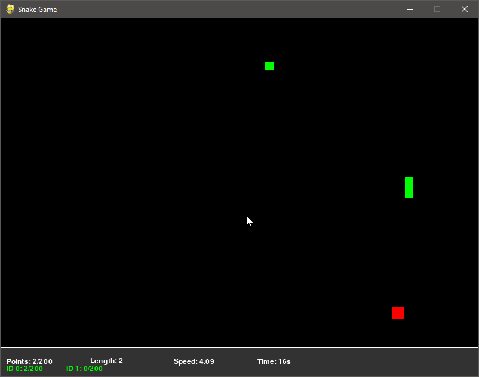

# Snake Game

This is a classic Snake game implemented using Pygame.

## Features

* Multiple levels with different terrains and challenges
* Bonus items that can help or hinder the player
* Highest score tracking
* Customizable game options

## Usage

To run the game, make sure you have Pygame installed and run `main.py`.
For requirements you can simply run 'pip install -r requirements.txt'

When you run the game, you will be presented with a menu where you can choose to start the game, view the high scores, choose color, or quit. If you choose to start the game, you will be able to select a level from a list of available levels. Each level has its own unique challenges and obstacles, such as terrain that slows down the snake or walls that block its path.

During the game, you control the snake with the arrow keys. The goal is to eat as much food as possible without crashing into the walls, the snakes' bodies, or other obstacles. Bonus items can help you achieve your goal by giving you extra points or speeding up the snake. However, some bonuses can also slow down the snake or have other effects.

When the game ends, you will be shown your final score and given the option to view the high scores or return to the main menu.

''
''
''